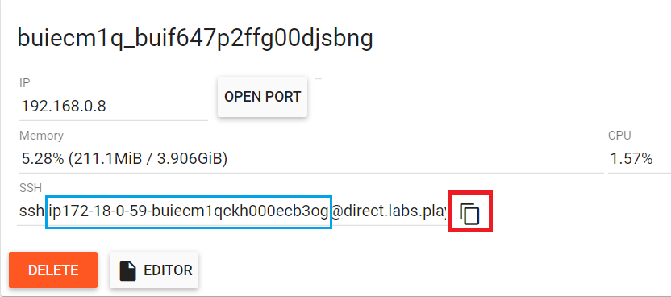
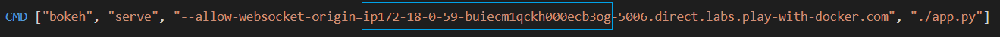
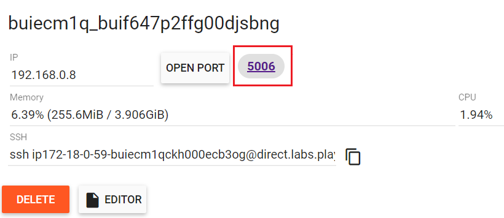

# DSCI560_HW5
California Coronavirus Dashboard

## Instructions for executing the dashboard on your computer
### 1. Install Python 3.7.8
### 2. Open your terminal and go to the directory you want to download this repository
### 3. Download this repository in the directory
```
git clone https://github.com/Myunghee13/DSCI560_HW5.git
```
### 4. Go to the repository folder you downloaded 
```
cd DSCI560_HW5
```
### 5. Install virtualenv
```
pip install virtualenv
```
### 6. Create a virtual environment, named visu
```
py -m venv visu
```
### 7. Activate the virtual environment, visu
```
.\visu\Scripts\activate
```
### 8. Install the dependencies
```
pip install -r requirements.txt
```
### 9. Execute app.py
```
bokeh serve --show app.py
```
### 10. You can see the dashboard on your browser.
```
http://localhost:5006/app
```
### 11. To finish executing it:
```
ctrl + c
```
### 12. Deactivate the virtual environment, visu
```
deactivate
```
## Instructions for executing the dashboard through Docker
### 1. Go to [play with docker](https://labs.play-with-docker.com/).
### 2. Log in docker and click start.
### 3. Add new instance
### 4.  Download this repository
```
git clone https://github.com/Myunghee13/DSCI560_HW5.git
```
### 5. Go to the repository folder you downloaded 
```
cd DSCI560_HW5
```
### 6. Get ssh ip in the blue box by clicking red box
<p align="left">
    
</p>

### 7. Open Dockerfile to edit it.
```
vim Dockerfile
```
### 8. Enter 'i' for insert mode to revise the Dockerfile
### 9. Revise ssh ip in the last line to your ssh ip obtained from step 6. The ssh ip starts with ip and ends before "-5006."
<p align="center">
    
</p>

### 10. Save the revised Dockerfile by pressing Esc key, and then enter:
```
:wq!
```
### 11. Create docker image from the Dockerfile
```
docker build . -t dashboard
```
### 12. Check if the docker image, dashboard, is created
```
docker images -a
```
### 13. Execute the docker image, dashboard 
```
docker run --rm -p 5006:5006 -it dashboard
```
### 14. Click port number to see the dashboard
<p align="left">
    
</p>
